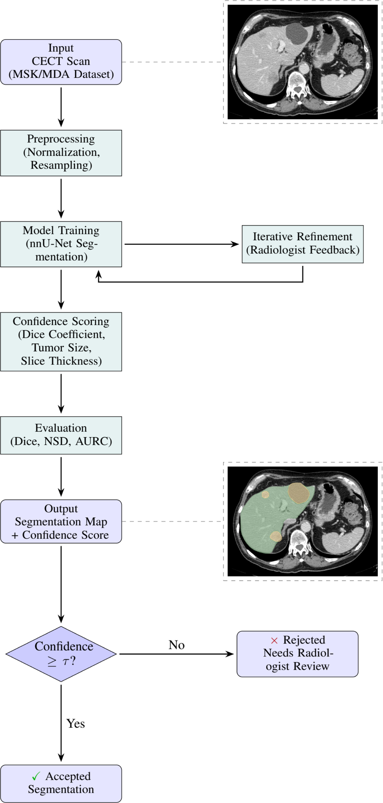
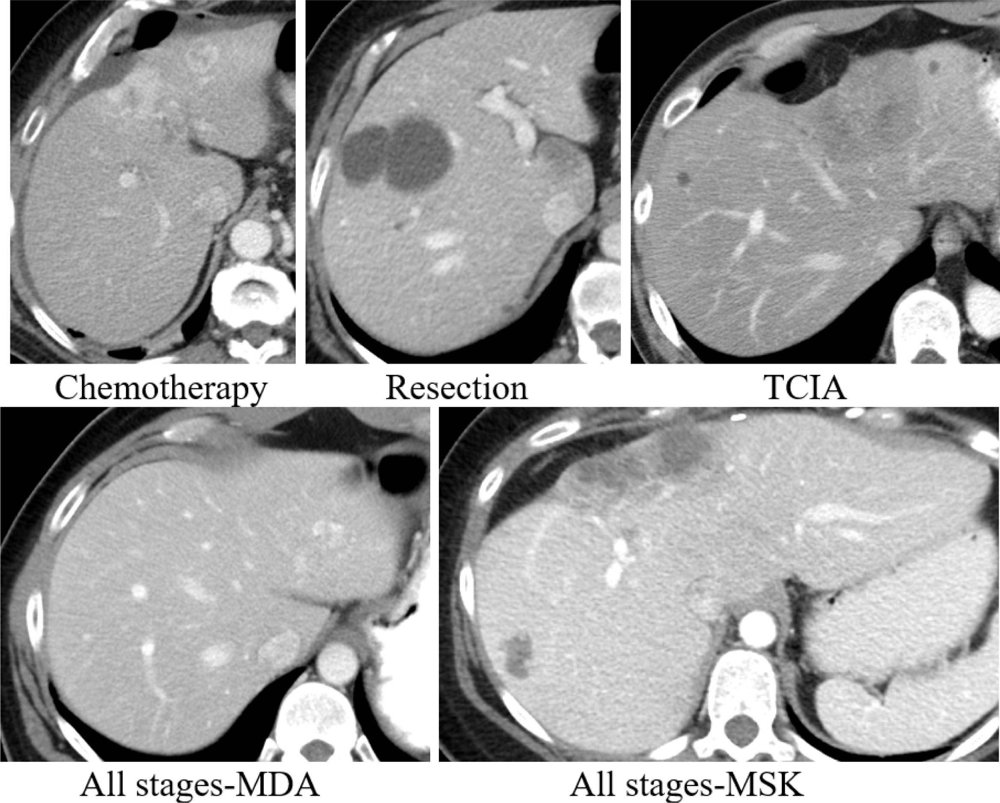
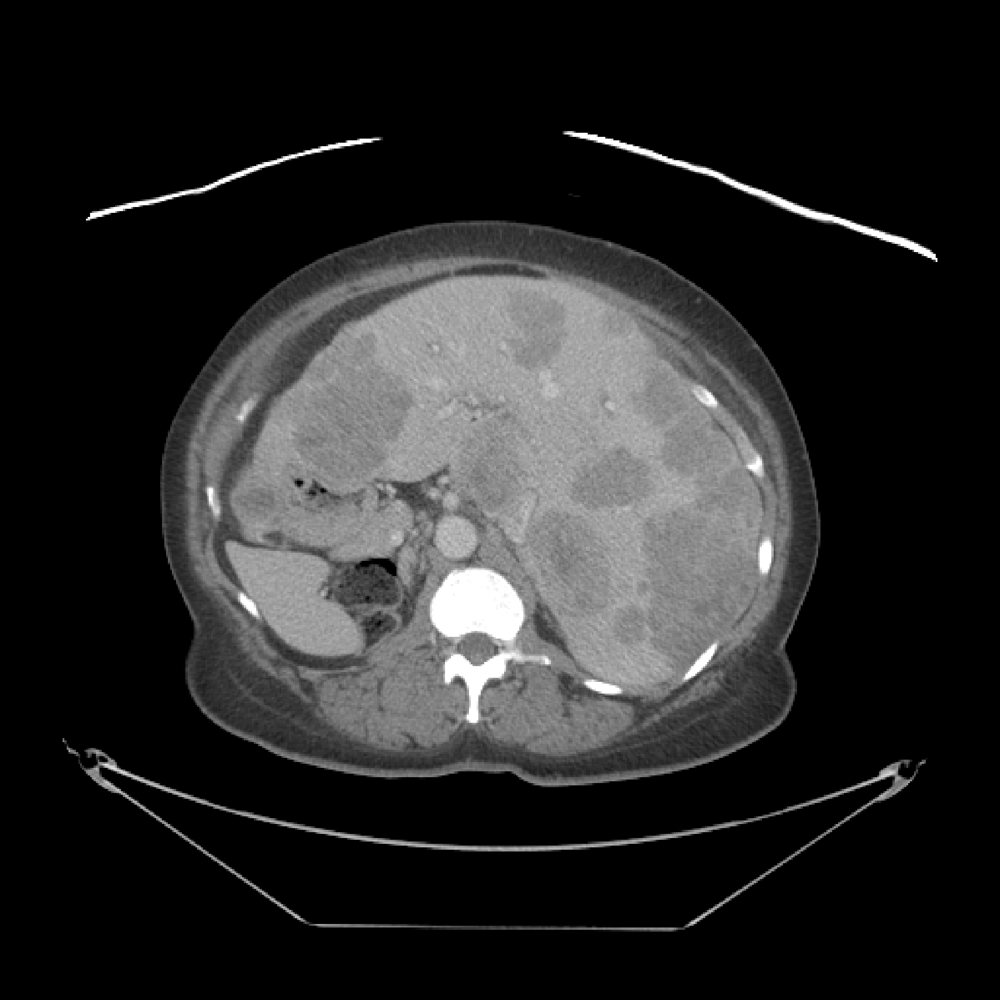
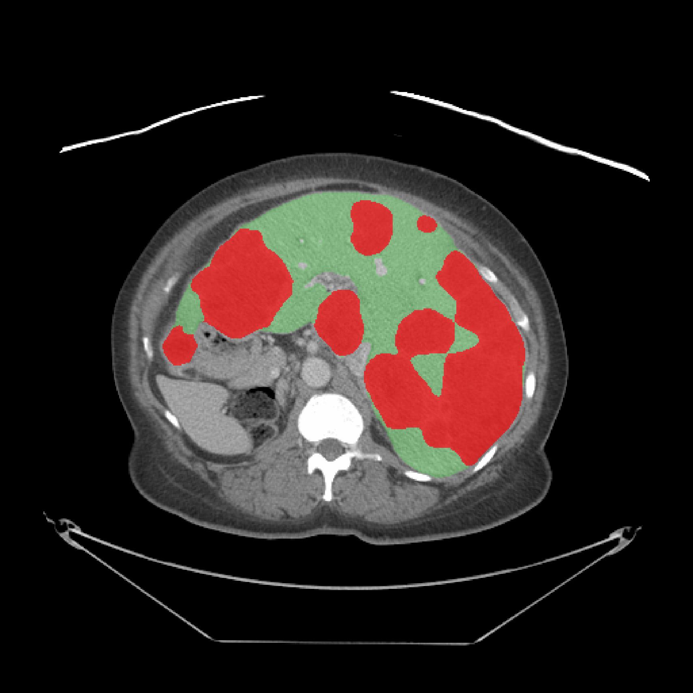

# Liver Cancer Segmentator

**Liver Cancer Segmentator (LCS): Metadata-Guided Confidence Scoring for Reliable Segmentation of Colorectal Liver Metastases in CT**

A deep learning pipeline for automated segmentation of liver parenchyma and colorectal liver metastases (CRLM) from contrast-enhanced abdominal CT images using **nnUNet-based 3D medical image segmentation**.

This repository provides:

* Reproducible nnUNet inference pipeline
* Automatic model downloading from Hugging Face
* Five-fold nnUNet ensemble inference
* Multi-class segmentation of liver and tumor regions
* Confidence-based failure detection for low-reliability predictions
* Containerized deployment architecture for AI inference services

The trained model checkpoints are publicly available:

**Hugging Face Model Repository**

https://huggingface.co/Hamghalam/liver-cancer-segmentation-nnunet

---

# Overview

Accurate segmentation of colorectal liver metastases (CRLM) in CT images is essential for quantitative tumor assessment, treatment planning, and AI-assisted radiology workflows.

This project introduces the **Liver Cancer Segmentator (LCS)**, a deep learning model developed for automatic and robust segmentation of:

* Liver parenchyma
* Colorectal liver metastases tumors

The model was trained and evaluated using a multi-institutional dataset of patients with colorectal liver metastases, including diverse disease stages and treatment settings.

The segmentation task is formulated as a three-class problem:

| Label | Structure                           |
| ----- | ----------------------------------- |
| 0     | Background                          |
| 1     | Liver                               |
| 2     | Tumor (colorectal liver metastasis) |

---

# End-to-End Pipeline

The complete LCS workflow integrates image preprocessing, nnUNet segmentation, and confidence-based quality assessment.

The pipeline:

1. Receives contrast-enhanced CT images
2. Performs automated nnUNet preprocessing
3. Generates liver and tumor segmentation masks
4. Estimates prediction reliability using ensemble-disagreement confidence scoring
5. Flags low-confidence predictions for further review



---

# Dataset Characteristics

The model was developed using **446 contrast-enhanced CT examinations** from patients with colorectal liver metastases.

Dataset distribution:

* 355 cases used for training
* 91 cases used for testing
* Data collected from two institutions
* Multiple disease stages and treatment settings represented

Representative CT examples from the five cohorts are shown below:

* Chemotherapy
* Resection
* TCIA
* All stages-MDA
* All stages-MSK



---

# Model Architecture

The segmentation model is based on:

* **Framework:** nnUNet v1
* **Architecture:** 3D U-Net
* **Configuration:** 3D Full Resolution
* **Training strategy:** Five-fold cross-validation ensemble
* **Deep learning framework:** PyTorch

During inference, predictions from all five trained folds are combined to improve robustness and generalization.

Pipeline:

```
                 CT Image
                     |
          nnUNet preprocessing
                     |
      --------------------------------
      |       |       |       |       |
    fold0   fold1   fold2   fold3   fold4
      --------------------------------
                     |
          Ensemble prediction
                     |
          Liver + Tumor mask
                     |
        Confidence-based failure detection
                     |
        Review priority / reliability report
```

---

# Repository Structure

```
liverCancerSegmentator/

├── src/
│   ├── inference.py
│   └── model_loader.py
│
├── scripts/
│   └── download_model.py
│
├── models/
│   └── nnUNet model weights
│
├── demo/
│   ├── ct_slice.png
│   └── example_result.png
│
├── failureDetection/
│   ├── fd_clean.ipynb
│   ├── failure_detection.py
│   ├── metrics.py
│   ├── plots.py
│   └── README.md
│
├── docker/
│   ├── api/
│   └── inference/
│
├── docker-compose.yml
│
├── pyproject.toml
│
└── README.md
```

---

# Installation

## Clone Repository

```bash
git clone https://github.com/hamghalam/liverCancerSegmentator.git

cd liverCancerSegmentator
```

## Create Python Environment

```bash
python -m venv .venv

source .venv/bin/activate
```

Install dependencies:

```bash
pip install -e ".[api,notebook]"
```

---

# Download Model

The trained nnUNet checkpoints are hosted on Hugging Face.

Download:

```bash
python scripts/download_model.py
```

Model structure:

```
models/

└── model/
    └── nnUNetTrainerV2__nnUNetPlansv2.1/
        |
        ├── plans.pkl
        |
        ├── fold_0/
        ├── fold_1/
        ├── fold_2/
        ├── fold_3/
        └── fold_4/
```

---

# Inference

Prepare CT images in NIfTI format:

```
test_input/

└── patient_001_0000.nii.gz
```

nnUNet automatically performs:

* Image resampling
* Intensity normalization
* Foreground cropping
* Patch-based inference
* Restoration to original image geometry

Run inference:

```bash
python src/inference.py \
--input test_input \
--output ./output_mask \
--model ./models/model/nnUNetTrainerV2__nnUNetPlansv2.1
```

Output:

```
output_mask/

└── patient_001.nii.gz
```

---

# Confidence-Based Failure Detection

The segmentation pipeline includes an optional reliability layer for identifying predictions that may require human review.

This analysis uses the five-fold nnUNet ensemble to estimate confidence from agreement between fold predictions. Low agreement suggests higher uncertainty and a greater chance of segmentation failure.

The failure-detection workflow computes:

* **DSC:** segmentation accuracy against reference masks
* **Risk:** `1 - DSC`
* **Confidence:** mean pairwise Dice agreement across ensemble folds
* **AURC:** area under the risk-coverage curve for evaluating failure ranking
* **Cohort analysis:** reliability differences across patient cohorts and acquisition settings

The cleaned public notebook is available at:

```text
failureDetection/fd_clean.ipynb
```

Supporting utilities are provided in:

```text
failureDetection/metrics.py
failureDetection/failure_detection.py
failureDetection/plots.py
```

Expected evaluation layout:

```text
data/
├── labels/
│   └── patient_001.nii.gz
└── predictions/
    ├── ensemble/
    │   └── patient_001.nii.gz
    ├── fold_0/
    ├── fold_1/
    ├── fold_2/
    ├── fold_3/
    └── fold_4/
```

Run the notebook:

```bash
jupyter notebook failureDetection/fd_clean.ipynb
```

For a production-style command-line run, use:

```bash
python -m failureDetection.confidence_cli \
--input data/input \
--output data/output \
--model models/nnUNetTrainerV2__nnUNetPlansv2.1 \
--case-id patient_001
```

This command saves:

```text
data/output/
├── patient_001.nii.gz
├── patient_001_confidence.json
└── fold_predictions/
    ├── fold_0/patient_001.nii.gz
    ├── fold_1/patient_001.nii.gz
    ├── fold_2/patient_001.nii.gz
    ├── fold_3/patient_001.nii.gz
    └── fold_4/patient_001.nii.gz
```

The JSON metadata includes pairwise fold Dice confidence, fold prediction paths, voxel spacing, image size, and estimated tumor volume.

This reliability module is intended for research evaluation and quality-control workflows. It does not replace expert review.

---

# Demo Visualization

Example output generated using the provided inference pipeline.

The visualization demonstrates:

* Original CT slice
* Liver segmentation
* Tumor segmentation





---

# Evaluation Performance

Performance was evaluated using Dice similarity coefficient (DSC).

| Structure | Dice Score                     |
| --------- | ------------------------------ |
| Liver     | 0.9707 (95% CI: 0.9663–0.9751) |
| Tumor     | 0.7695 (95% CI: 0.7166–0.8224) |

Normalized surface distance at 3 mm tolerance:

| Structure | NSD    |
| --------- | ------ |
| Liver     | 0.9605 |
| Tumor     | 0.8412 |

---

# Containerized Deployment

The repository includes a container-based deployment architecture designed for scalable AI inference services.

Architecture:

```
                    User
                      |
                      |
              FastAPI REST API
                      |
             ------------------
             Shared Volume
             ------------------
                      |
          nnUNet Inference Service
                      |
          Liver + Tumor Segmentation
```

## API Service

Provides:

* CT file upload
* Input validation
* Automatic nnUNet filename conversion
* Inference request handling
* Segmentation result delivery

## nnUNet Inference Service

Provides:

* GPU-enabled inference
* Five-fold ensemble prediction
* Automated preprocessing
* Segmentation generation

---

# Docker Deployment

Requirements:

* Docker
* Docker Compose
* NVIDIA GPU (recommended)
* NVIDIA Container Toolkit

Build:

```bash
docker compose build
```

Run:

```bash
docker compose up
```

API endpoint:

```
http://localhost:8000
```

---

# API Usage

Example:

```bash
curl \
-X POST \
-F "file=@patient.nii.gz" \
http://localhost:8000/segment \
-o segmentation.nii.gz
```

The service automatically handles:

```
patient.nii.gz

        ↓

patient_0000.nii.gz

        ↓

nnUNet inference

        ↓

segmentation mask
```

Confidence-enabled inference:

```bash
curl \
-X POST \
-F "file=@patient.nii.gz" \
http://localhost:8000/segment-with-confidence
```

This endpoint returns JSON with the saved segmentation path, confidence metadata path, pairwise fold agreement scores, and basic segmentation metadata.

---

# Dataset Availability

The training dataset contains multi-institutional CT examinations of patients with colorectal liver metastases.

Due to privacy restrictions, the clinical dataset is not publicly released.

---

# Intended Use

This repository is intended for:

* Research in medical image analysis
* Development of AI-assisted radiology tools
* Benchmarking segmentation algorithms
* Reproducible evaluation of nnUNet-based pipelines

## Limitations

* Performance may vary across scanners, acquisition protocols, contrast phases, and patient populations.
* The model was specifically developed for colorectal liver metastasis cases.
* External validation is required before clinical deployment.
* This model is not intended for autonomous clinical decision-making.

---

# Citation

If you use this model, please cite:

```bibtex
@article{hamghalam2026liver,
title={Liver cancer segmentator: Metadata-guided confidence scoring for reliable segmentation of colorectal liver metastases in CT},
author={Hamghalam, Mohammad and others},
journal={Computer Methods and Programs in Biomedicine},
volume={276},
pages={109233},
year={2026}
}
```

Please also cite nnUNet:

```bibtex
@article{isensee2021nnunet,
title={nnU-Net: a self-configuring method for deep learning-based biomedical image segmentation},
author={Isensee, Fabian and others},
journal={Nature Methods},
year={2021}
}
```

---

# License

Please refer to the repository license and dataset restrictions before using this model.
