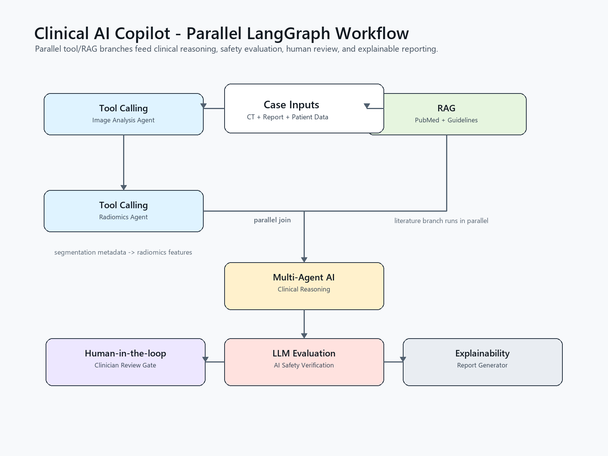

# Clinical AI Copilot

Clinical AI Copilot is a portfolio-ready multi-agent extension for the Liver Cancer Segmentator project. It uses LangGraph to coordinate image analysis, radiomics, medical literature retrieval, clinical reasoning, evidence verification, and final report generation for colorectal liver metastasis case review.

This module is designed for research and engineering demonstration. It does not provide autonomous diagnosis or treatment recommendations.

## Why this matters

The base repository already performs nnUNet liver/tumor segmentation and confidence-based failure detection. This folder adds the clinical AI orchestration layer that industrial teams often look for:

* LangGraph agent orchestration
* Multi-agent AI workflow design
* Planner, memory, and reducer graph nodes
* RAG-ready medical literature retrieval
* Tool calling over segmentation metadata
* LLM evaluation and hallucination checks
* Human-in-the-loop safety gates
* Explainable report generation

## Agents

| Agent | Role | Output |
| --- | --- | --- |
| Planner Agent | Creates the execution plan and defines parallel branches, join strategy, and safety gates. | Execution plan |
| Memory Agent | Retrieves prior case context from a local JSON memory store. | Longitudinal memory context |
| Image Analysis Agent | Reads nnUNet confidence metadata, tumor volume, lesion burden, and uncertainty. | Structured image summary |
| Radiomics Agent | Prepares a PyRadiomics-ready feature summary and response signal placeholder. | Radiomics feature summary |
| Medical Literature Agent | Retrieves local guideline snippets and searches PubMed through NCBI E-utilities. | RAG evidence list |
| Reducer Agent | Merges imaging, radiomics, evidence, plan, and memory into compact reasoning context. | Reduced context |
| Clinical Reasoning Agent | Synthesizes imaging, radiomics, report text, patient context, and evidence. | Cautious clinical assessment |
| Evidence Verification Agent | Checks unsupported claims and hallucination risk. | Safety verification |
| Human-in-the-loop Review | Creates a clinician review packet and can pause with LangGraph `interrupt()`. | Approval gate |
| Report Generator | Produces a clinician-readable report with traceable inputs. | Markdown report |

## Install

From the repository root:

```bash
pip install -e ".[copilot]"
```

For offline demos without calling Gemini:

```bash
set COPILOT_MOCK_LLM=1
python -m clinical_ai_copilot.run_demo
```

For Google Gemini and LangSmith tracing:

```bash
set GOOGLE_API_KEY=your_google_api_key
set LANGSMITH_API_KEY=your_langsmith_api_key
set LANGSMITH_PROJECT=clinical-ai-copilot
set COPILOT_ENABLE_PUBMED=1
set COPILOT_MEMORY_PATH=clinical_ai_copilot_output/case_memory.json
python -m clinical_ai_copilot.run_demo
```

On Linux/macOS, use `export` instead of `set`.

Enable a real LangGraph human approval pause:

```bash
set COPILOT_ENABLE_HUMAN_INTERRUPT=1
```

When this is disabled, the graph still creates a structured human-review packet and marks the report as pending review.

## Use with nnUNet confidence metadata

First run the existing confidence pipeline:

```bash
python -m failureDetection.confidence_cli \
  --input data/input \
  --output data/output \
  --model models/nnUNetTrainerV2__nnUNetPlansv2.1 \
  --case-id patient_001
```

Then point a case JSON file at the generated metadata:

```json
{
  "case_id": "patient_001",
  "ct_path": "data/input/patient_001_0000.nii.gz",
  "segmentation_metadata_path": "data/output/patient_001_confidence.json",
  "radiology_report": "Multiple colorectal liver metastases...",
  "patient_profile": {
    "age": 62,
    "sex": "female",
    "primary_cancer": "colorectal cancer",
    "performance_status": "ECOG 1"
  },
  "clinical_question": "Assess treatment response likelihood and surgical review suitability.",
  "guidelines": [],
  "human_review_required": true,
  "audit_log": []
}
```

Run:

```bash
python -m clinical_ai_copilot.run_demo --case path/to/case.json --output reports/patient_001.md
```

## Architecture



```text
CT Scan + Radiology Report + Patient Data + Guidelines
        |
        v
Planner: Agent Orchestration
        |-------------------------|-------------------------|
        v                         v                         v
Memory: Case Context       Tool Calling: Image Analysis    RAG: PubMed + Guidelines
                                  |                         |
                                  v                         |
                         Tool Calling: Radiomics            |
        |-------------------------|-------------------------|
        v
Reducer: Evidence + Imaging Context
        |
        v
Multi-Agent AI: Clinical Reasoning
        |
        v
LLM Evaluation + AI Safety
        |
        v
Human-in-the-loop Review
        |
        v
Explainability: Report Generator
```

## Display the LangGraph

In a notebook:

```python
from IPython.display import Image, display
from clinical_ai_copilot.graph import build_copilot_graph

react_graph = build_copilot_graph()
display(Image(react_graph.get_graph(xray=True).draw_mermaid_png()))
```

From the command line:

```bash
python -m clinical_ai_copilot.visualize_graph --format mermaid --output clinical_ai_copilot_output/langgraph.mmd
python -m clinical_ai_copilot.visualize_graph --format png --output clinical_ai_copilot_output/langgraph.png
python -m clinical_ai_copilot.render_static_graph --output clinical_ai_copilot/assets/clinical_ai_copilot_graph.png
```

The rendered node labels intentionally highlight **Multi-Agent AI**, **Agent Orchestration**, **RAG**, **LLM Evaluation**, **Human-in-the-loop**, **Tool Calling**, **AI Safety**, and **Explainability**.

## Resume bullets

* Built a LangGraph-based multi-agent Clinical AI Copilot for CT-driven colorectal liver metastasis assessment.
* Integrated nnUNet segmentation metadata, uncertainty scoring, radiology text, patient context, and guideline evidence into a structured agent workflow.
* Added evidence verification and human-in-the-loop safety gates to reduce hallucination risk in medical AI outputs.
* Designed a RAG literature agent that searches PubMed and combines retrieved articles with guideline evidence for explainable clinical report generation.

## Safety note

This module is for software engineering, medical AI research, and portfolio demonstration. All outputs require expert clinical review.
